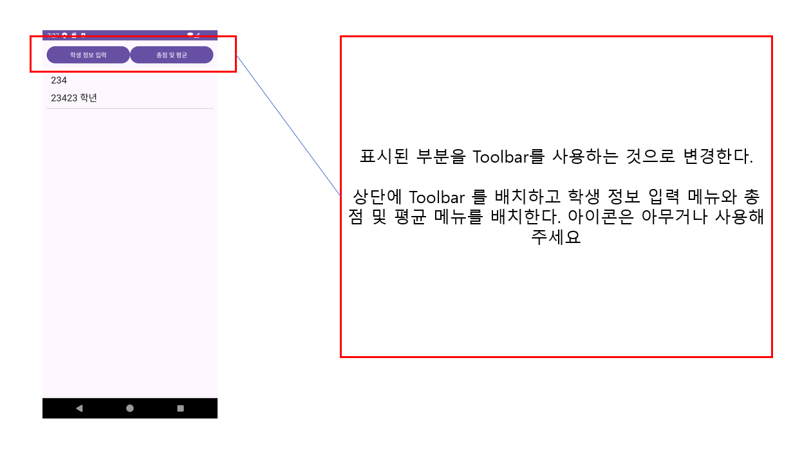
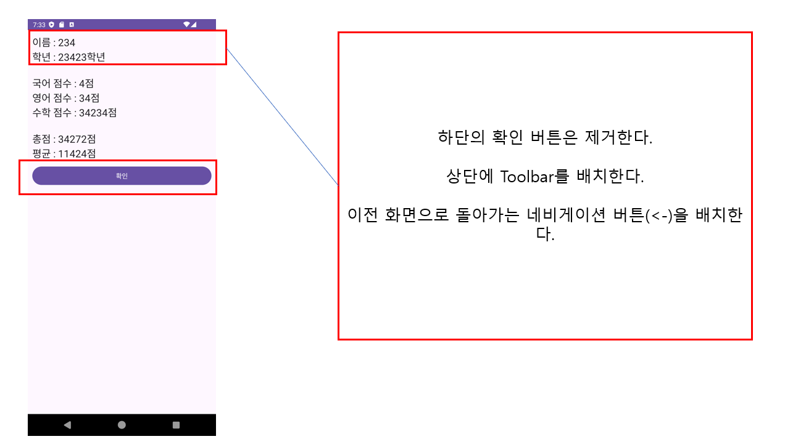

# Android Review04 - TedMoon

---

## 1번

## 2번

## 3번

## 4번

# Firebase Console을 사용하여 Firebase 이용하기

---

- 참고 영상 : https://youtu.be/jbHfJpoOzkI?si=WW_xjHCJwJXRp9rk
- 참고 문서 : https://firebase.google.com/docs/android/setup?hl=ko&authuser=0&_gl=1*1r2ijce*_up*MQ..*_ga*MzgyNzU1MjIxLjE3MjAxNjgyNDA.*_ga_CW55HF8NVT*MTcyMDQyNDQwMC45LjEuMTcyMDQyNzIxOS4wLjAuMA..#prerequisites