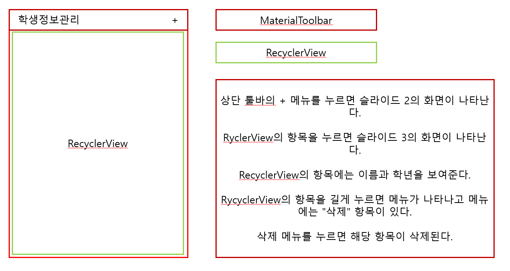

# Android_Review05_TedMoon

---

## 문제 사진 첨부

### 1. 메인 화면

### 2. 입력 화면

### 3. 정보 조회 화면 

## 필요한 개념 정리

---
- showAsAction : 메뉴 항목을 Toolbar에 배치할 것인지를 설정한다
  - always : 항상 Toolbar에 배치한다
  - ifRoom : `공간이 허락할 경우`에 Toolbar에 배치한다
  - never : Toolbar에 배치하지 않는다 
  - withText : 아이콘이 설정되어 있을 경우 아이콘이 보여지고 공간이 허락되면 menu의 title에 설정된 문자열도 보인다 

- setTitleTextColor() : 타이틀 문자열 색상을 설정한다